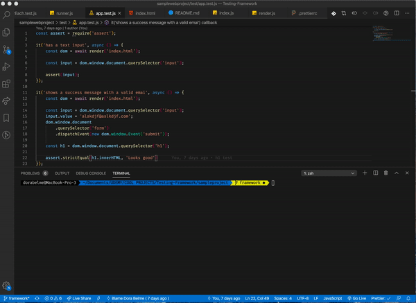

# Testing Framework

Node-based CLI framework, able to test browser-based JS apps built from scratch. Works as Mocha.

## Short demo:

## Tech Stack

-   Node.js
-   Chalk
-   JSDOM

## Installation

1. `git clone git@github.com:dorabelme/Testing-Framework.git`
2. Run `npm install` to get dependencies for the project
3. Run `tme [..]`, optional command line argument
